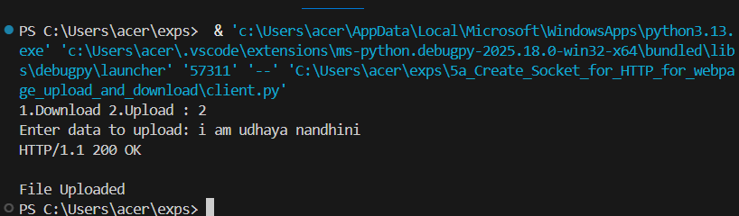
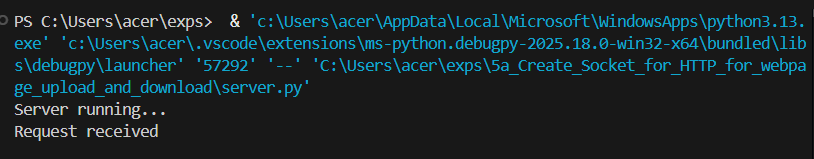

# 5a_Create_Socket_for_HTTP_for_webpage_upload_and_download
## AIM :
To write a PYTHON program for socket for HTTP for web page upload and download
## Algorithm
Algorithm

1.Start the program.
<BR>
2.Create a socket at the server side and bind it to localhost and port 8080.
<BR>
3.Put the server in listening mode.
<BR>
4.Create a client socket and connect it to the server.
<BR>
5.Display options Download or Upload to the user.
<BR>
6.If Download is selected, the client sends an HTTP GET request and receives the webpage from the server.
<BR>
7.If Upload is selected, the client sends an HTTP POST request with data to the server.
<BR>
8.The server processes the request and sends a response to the client.
<BR>
9.Close the connection.
<BR>
10.Stop the program.
<BR>

## Program 

Server.py

```
import socket

s = socket.socket()
s.bind(("localhost",3024))
s.listen(1)

print("Server running...")

while True:
    c,addr = s.accept()
    
    request = c.recv(1024).decode()
    print("Request received")

    if "GET" in request:
        f = open("index.html","r")
        data = f.read()
        f.close()

        response = "HTTP/1.1 200 OK\n\n" + data
        c.send(response.encode())

    elif "POST" in request:
        data = request.split("\n\n")[1]

        f = open("upload.txt","w")
        f.write(data)
        f.close()

        c.send("HTTP/1.1 200 OK\n\nFile Uploaded".encode())

    c.close()
 ```
 Client.py 

```
    import socket

s = socket.socket()
s.connect(("localhost",3024))

ch = input("1.Download 2.Upload : ")

if ch == "1":
    req = "GET / HTTP/1.1\nHost: localhost\n\n"
    s.send(req.encode())

    data = s.recv(4096)
    print(data.decode())

else:
    msg = input("Enter data to upload: ")

    req = "POST / HTTP/1.1\nHost: localhost\n\n" + msg
    s.send(req.encode())

    data = s.recv(1024)
    print(data.decode())

s.close()
```
Index.html

```
<html>
    <head>
        <title>index html server</title>
    </head>
    <body>
        <h1>Hello from python socket server</h1>
        
    </body>
   
</html>
```

## OUTPUT


## Result
Thus the socket for HTTP for web page upload and download created and Executed
